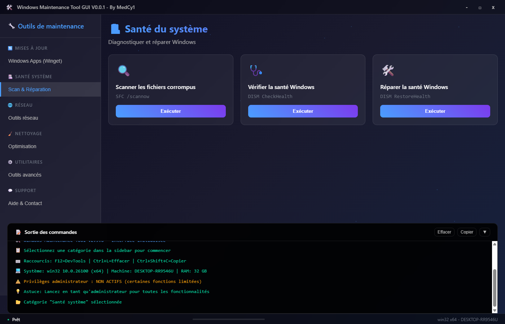
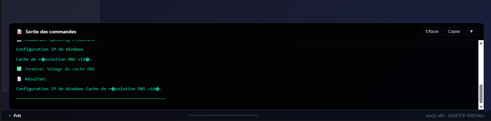

# 🛠️ Windows Maintenance Tool GUI

<div align="center">


**Une interface graphique moderne pour les outils de maintenance Windows**

[📥 Télécharger](https://github.com/MedCy1/Windows-Maintenance-Tool-GUI/releases/latest) •
[🐛 Signaler un bug](https://github.com/MedCy1/Windows-Maintenance-Tool-GUI/issues) •
[💡 Demander une fonctionnalité](https://github.com/MedCy1/Windows-Maintenance-Tool-GUI/issues)

</div>

---

## 📋 Table des matières

- [🎯 À propos](#-à-propos)
- [✨ Fonctionnalités](#-fonctionnalités)
- [📸 Screenshots](#-screenshots)
- [⚡ Installation rapide](#-installation-rapide)
- [🚀 Utilisation](#-utilisation)
- [🔧 Développement](#-développement)
- [📦 Build](#-build)
- [🤝 Contribution](#-contribution)
- [📄 Licence](#-licence)
- [⚠️ Avertissement](#️-avertissement)

---

## 🎯 À propos

**Windows Maintenance Tool GUI** est une application Electron moderne qui fournit une interface graphique intuitive pour les outils de maintenance Windows les plus couramment utilisés. Fini les lignes de commande complexes - maintenez votre système Windows en quelques clics !

### 🎨 Pourquoi cette application ?

- **Interface moderne** : Design glassmorphism avec animations fluides
- **Facilité d'utilisation** : Plus besoin de mémoriser les commandes CMD
- **Sécurité** : Demande d'élévation des privilèges seulement quand nécessaire
- **Transparence** : Affichage en temps réel des sorties des commandes
- **Organisation** : Outils classés par catégories logiques

---

## ✨ Fonctionnalités

### 🏥 Santé système
- **SFC Scan** (`sfc /scannow`) - Vérification des fichiers système corrompus
- **DISM Health Check** - Vérification de l'intégrité de l'image Windows
- **DISM Cleanup** - Nettoyage des composants Windows
- **Réparation de l'image système** - Restauration automatique

### 🧹 Nettoyage
- **Nettoyage disque** - Suppression des fichiers temporaires
- **Nettoyage DNS** - Vidage du cache DNS
- **Nettoyage navigateurs** - Suppression des données de navigation
- **Nettoyage registre** - Optimisation du registre Windows

### 🔄 Optimisation
- **Défragmentation** - Optimisation des disques durs
- **Nettoyage de démarrage** - Gestion des programmes au démarrage
- **Optimisation mémoire** - Libération de la RAM
- **Services Windows** - Gestion des services système

### 🔒 Sécurité
- **Windows Defender** - Scan antivirus complet
- **Windows Update** - Vérification et installation des mises à jour
- **Pare-feu Windows** - Configuration et vérification
- **Sauvegardes système** - Création de points de restauration

### 🛠️ Fonctionnalités avancées
- **Privilèges automatiques** - Élévation seulement quand nécessaire
- **Sortie en temps réel** - Affichage live des commandes
- **Logs détaillés** - Historique de toutes les opérations
- **Interface responsive** - S'adapte à toutes les tailles d'écran
- **Raccourcis clavier** - Navigation rapide (F12, Ctrl+L, Ctrl+Shift+C)

---

## 📸 Screenshots

<div align="center">

### Interface principale


### Outils de santé système


### Sortie en temps réel


</div>

---

## ⚡ Installation rapide

### Option 1: Téléchargement direct (Recommandé)

1. Allez sur la [page des releases](https://github.com/MedCy1/Windows-Maintenance-Tool-GUI/releases/latest)
2. Téléchargez `windows-maintenance-tool-gui Setup x.x.x.exe`
3. Exécutez l'installateur et suivez les instructions
4. Lancez l'application depuis le menu Démarrer

### Option 2: Installation portable

1. Téléchargez `windows-maintenance-tool-gui Portable x.x.x.zip`
2. Extrayez le contenu dans un dossier de votre choix
3. Exécutez `Windows-Maintenance-Tool.exe`

### Configuration système requise

- **OS** : Windows 10/11 (64-bit)
- **RAM** : 4 GB minimum, 8 GB recommandé
- **Espace disque** : 200 MB pour l'installation
- **Privilèges** : Compte utilisateur standard (élévation automatique si nécessaire)

---

## 🚀 Utilisation

### Premier lancement

1. **Lancez l'application** normalement (pas besoin d'être administrateur)
2. **Sélectionnez une catégorie** dans la barre latérale gauche
3. **Choisissez un outil** dans la liste centrale
4. **Cliquez sur "Exécuter"** - L'application demandera les privilèges si nécessaire

### Conseils d'utilisation

- 🔐 **Privilèges** : L'application demande l'élévation seulement pour les outils qui en ont besoin
- 📊 **Progression** : Surveillez la barre de progression et les logs en temps réel
- ⌨️ **Raccourcis** : 
  - `F12` : Ouvrir/fermer les outils de développement
  - `Ctrl+L` : Effacer les logs
  - `Ctrl+Shift+C` : Copier les logs dans le presse-papiers
- 💾 **Logs** : Tous les logs sont automatiquement horodatés et peuvent être copiés

### Exemples d'utilisation

**Problème de fichiers système corrompus :**
1. Catégorie "Santé système" → "Scanner les fichiers corrompus"
2. Confirmez l'élévation UAC
3. Attendez la fin du scan et suivez les recommandations

**Nettoyage rapide du système :**
1. Catégorie "Nettoyage" → "Nettoyage disque complet"
2. Sélectionnez les éléments à nettoyer
3. Confirmez et attendez la fin

---

## 🔧 Développement

### Prérequis

- **Node.js** 18+ ([télécharger](https://nodejs.org/))
- **npm** ou **yarn**
- **Git** ([télécharger](https://git-scm.com/))

### Installation pour le développement

```bash
# Cloner le repository
git clone https://github.com/MedCy1/Windows-Maintenance-Tool-GUI.git
cd Windows-Maintenance-Tool-GUI

# Installer les dépendances
npm install

# Lancer en mode développement
npm run dev

# Lancer avec les DevTools
npm run dev-debug

# Lancer en mode administrateur (pour tester les privilèges)
npm run dev-admin
```

### Structure du projet

```
Windows-Maintenance-Tool-GUI/
├── src/                    # Code source de l'interface
│   ├── index.html         # Interface principale
│   ├── css/              # Styles CSS
│   └── js/               # Scripts JavaScript
├── main.js               # Processus principal Electron
├── package.json          # Configuration Node.js
├── build/                # Configuration de build
└── docs/                 # Documentation et screenshots
```

### Scripts de développement

```bash
npm run dev              # Mode développement normal
npm run dev-debug        # Mode développement avec DevTools
npm run dev-admin        # Mode développement avec privilèges admin
npm run build            # Build de production
npm run test             # Tests (à implémenter)
```

### Contribution au code

1. **Fork** le projet
2. **Créez une branche** pour votre fonctionnalité (`git checkout -b feature/awesome-feature`)
3. **Commitez** vos changements (`git commit -m 'Add awesome feature'`)
4. **Push** vers la branche (`git push origin feature/awesome-feature`)
5. **Ouvrez une Pull Request**

---

## 📦 Build

### Build local

```bash
# Build pour Windows (installateur + portable)
npm run build

# Les fichiers de sortie seront dans le dossier dist/
```

### Build automatique (CI/CD)

Le projet utilise **GitHub Actions** pour automatiser les builds et releases :

- ✅ **Build automatique** à chaque push sur `main`
- 📦 **Release automatique** à chaque tag `v*`
- 🏗️ **Artifacts** : Installateur `.exe` et version portable `.zip`
- 🔄 **Multi-format** : NSIS installer, portable, et ZIP

---

## 🤝 Contribution

Les contributions sont les bienvenues ! Voici comment vous pouvez aider :

### 🐛 Signaler des bugs

1. Vérifiez que le bug n'a pas déjà été signalé
2. Utilisez le [template de bug report](https://github.com/MedCy1/Windows-Maintenance-Tool-GUI/issues/new?template=bug_report.md)
3. Incluez les logs d'erreur et votre configuration système

### 💡 Proposer des fonctionnalités

1. Vérifiez qu'elle n'a pas déjà été proposée
2. Utilisez le [template de feature request](https://github.com/MedCy1/Windows-Maintenance-Tool-GUI/issues/new?template=feature_request.md)
3. Décrivez clairement l'utilité et l'implémentation envisagée

### 🔧 Contribuer au code

- Respectez le style de code existant
- Ajoutez des commentaires pour les fonctions complexes
- Testez vos modifications sur différentes versions de Windows
- Mettez à jour la documentation si nécessaire

### 📝 Améliorer la documentation

- Corriger les fautes de frappe
- Ajouter des exemples d'utilisation
- Traduire en d'autres langues
- Créer des tutoriels vidéo

---

## 📄 Licence

Ce projet est sous licence **GNU Affero General Public License v3.0 (AGPLv3)**.

### Vous êtes libre de :
- ✅ **Utiliser**, **étudier** et **exécuter** le logiciel pour tout usage
- ✅ **Modifier** le code selon vos besoins
- ✅ **Distribuer** vos modifications sous la même licence

### Mais si vous :
- 📤 **Distribuez** ce projet ou une version modifiée, ou
- 🌐 **Fournissez ce service via un réseau** (comme une application web),

### Alors vous devez :
- 📝 **Rendre le code source complet disponible** sous la même licence

Cela garantit que les améliorations restent ouvertes et profitent à toute la communauté.

🔗 Voir le texte complet de la licence dans le fichier [LICENSE](./LICENSE).

---

## ⚠️ Avertissement

### Utilisation responsable

- 🔒 **Privilèges administrateur** : Cette application peut demander des privilèges élevés pour certaines opérations
- 💾 **Sauvegarde** : Toujours sauvegarder vos données importantes avant d'utiliser les outils de nettoyage
- 🧪 **Test** : Testez d'abord sur un système non critique si possible
- 📋 **Logs** : Consultez toujours les logs pour comprendre les actions effectuées

### Responsabilité

L'auteur ne peut être tenu responsable de tout dommage causé par l'utilisation de cet outil. Utilisez-le à vos propres risques et assurez-vous de comprendre les actions effectuées.

---

<div align="center">

**⭐ Si ce projet vous aide, n'hésitez pas à lui donner une étoile !**

Made with ❤️ by [MedCy1](https://github.com/MedCy1)

[🔝 Retour en haut](#️-windows-maintenance-tool-gui)

</div>