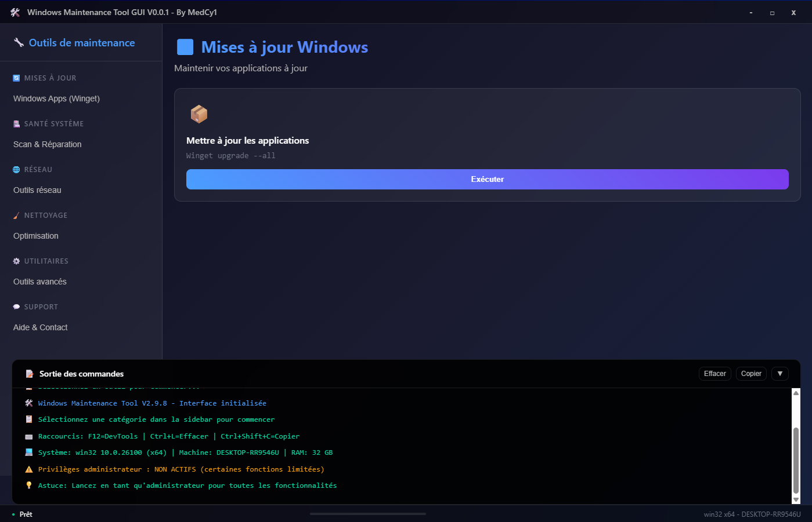

# 🛠️ Windows Maintenance Tool GUI

<div align="center">


**A modern graphical interface for Windows maintenance tools**

[📥 Download](https://github.com/MedCy1/Windows-Maintenance-Tool-GUI/releases/latest) •
[🐛 Report a bug](https://github.com/MedCy1/Windows-Maintenance-Tool-GUI/issues) •
[💡 Request a feature](https://github.com/MedCy1/Windows-Maintenance-Tool-GUI/issues)

[French README](docs/lang/README.FR.md)

</div>

---

## 📋 Table of Contents

- [🎯 About](#-about)
- [✨ Features](#-features)
- [📸 Screenshots](#-screenshots)
- [⚡ Quick Installation](#-quick-installation)
- [🚀 Usage](#-usage)
- [🔧 Development](#-development)
- [📦 Build](#-build)
- [🤝 Contributing](#-contributing)
- [📄 License](#-license)
- [⚠️ Disclaimer](#️-Disclaimer)

---

## 🎯 About

**Windows Maintenance Tool GUI** is a modern Electron application that provides an intuitive graphical interface for the most commonly used Windows maintenance tools. No more complex command lines—maintain your Windows system in just a few clicks!

### 🎨 Why this application?

- **Modern interface**: Glassmorphism design with smooth animations
- **Ease of use**: No need to memorize CMD commands
- **Security**: Requests privilege elevation only when necessary
- **Transparency**: Real-time display of command outputs
- **Organization**: Tools grouped by logical categories

---

## ✨ Features

### 🏥 System Health
- **SFC Scan** - Checks for corrupted system files
- **DISM Health Check** - Checks Windows image integrity
- **DISM Cleanup** - Cleans up Windows components
- **System Image Repair** - Automatic restoration

### 🧹 Cleaning
- **Disk Cleanup** - Removes temporary files
- **DNS Cleanup** - Flushes DNS cache
- **Browser Cleanup** - Deletes browsing data
- **Registry Cleanup** - Optimizes Windows registry

### 🔄 Optimization
- **Defragmentation** - Optimizes hard drives
- **Startup Cleanup** - Manages startup programs
- **Memory Optimization** - Frees up RAM
- **Windows Services** - Manages system services

### 🔒 Security
- **Windows Defender** - Full antivirus scan
- **Windows Update** - Checks and installs updates
- **Windows Firewall** - Configuration and verification
- **System Backups** - Creates restore points

### 🛠️ Advanced Features
- **Automatic privileges** - Elevation only when needed
- **Real-time output** - Live command display
- **Detailed logs** - History of all operations
- **Responsive interface** - Adapts to all screen sizes
- **Keyboard shortcuts** - Quick navigation (F12, Ctrl+L, Ctrl+Shift+C)

---

## 📸 Screenshots

<div align="center">

### Main Interface


### System Health Tools


### Real-time Output


</div>

---

## ⚡ Quick Installation

### Option 1: Direct Download (Recommended)

1. Go to the [releases page](https://github.com/MedCy1/Windows-Maintenance-Tool-GUI/releases/latest)
2. Download `windows-maintenance-tool-gui Setup x.x.x.exe`
3. Run the installer and follow the instructions
4. Launch the app from the Start menu

### Option 2: Portable Installation

1. Download `windows-maintenance-tool-gui Portable x.x.x.zip`
2. Extract the contents to a folder of your choice
3. Run `Windows-Maintenance-Tool.exe`

### System Requirements

- **OS**: Windows 10/11 (64-bit)
- **RAM**: 4 GB minimum, 8 GB recommended
- **Disk space**: 200 MB for installation
- **Privileges**: Standard user account (automatic elevation if needed)

---

## 🚀 Usage

### First Launch

1. **Launch the app** normally (no need to be administrator)
2. **Select a category** in the left sidebar
3. **Choose a tool** from the central list
4. **Click "Run"** – The app will request privileges if necessary

### Usage Tips

- 🔐 **Privileges**: The app requests elevation only for tools that require it
- 📊 **Progress**: Monitor the progress bar and real-time logs
- ⌨️ **Shortcuts**: 
  - `F12`: Open/close developer tools
  - `Ctrl+L`: Clear logs
  - `Ctrl+Shift+C`: Copy logs to clipboard
- 💾 **Logs**: All logs are automatically timestamped and can be copied

### Usage Examples

**Corrupted system files issue:**
1. "System Health" category → "Scan for corrupted files"
2. Confirm UAC elevation
3. Wait for the scan to finish and follow recommendations

**Quick system cleanup:**
1. "Cleaning" category → "Full disk cleanup"
2. Select items to clean
3. Confirm and wait for completion

---

## 🔧 Development

### Prerequisites

- **Node.js** 18+ ([download](https://nodejs.org/))
- **npm** or **yarn**
- **Git** ([download](https://git-scm.com/))

### Development Setup

```bash
# Clone the repository
git clone https://github.com/MedCy1/Windows-Maintenance-Tool-GUI.git
cd Windows-Maintenance-Tool-GUI

# Install dependencies
npm install

# Start in development mode
npm run dev

# Start with DevTools
npm run dev-debug

# Start as administrator (to test privileges)
npm run dev-admin
```

### Project Structure

```
Windows-Maintenance-Tool-GUI/
├── src/                    # UI source code
│   ├── index.html         # Main interface
│   ├── css/              # CSS styles
│   └── js/               # JavaScript scripts
├── main.js               # Electron main process
├── package.json          # Node.js configuration
├── build/                # Build configuration
└── docs/                 # Documentation and screenshots
```

### Development Scripts

```bash
npm run dev              # Normal development mode
npm run dev-debug        # Development mode with DevTools
npm run dev-admin        # Development mode with admin privileges
npm run build            # Production build
npm run test             # Tests (to be implemented)
```

### Contributing Code

1. **Fork** the project
2. **Create a branch** for your feature (`git checkout -b feature/awesome-feature`)
3. **Commit** your changes (`git commit -m 'Add awesome feature'`)
4. **Push** to your branch (`git push origin feature/awesome-feature`)
5. **Open a Pull Request**

---

## 📦 Build

### Local Build

```bash
# Build for Windows (installer + portable)
npm run build

# Output files will be in the dist/ folder
```

### Automatic Build (CI/CD)

The project uses **GitHub Actions** to automate builds and releases:

- ✅ **Automatic build** on every push to `main`
- 📦 **Automatic release** on every `v*` tag
- 🏗️ **Artifacts**: `.exe` installer and portable `.zip` version
- 🔄 **Multi-format**: NSIS installer, portable, and ZIP

---

## 🤝 Contributing

Contributions are welcome! Here’s how you can help:

### 🐛 Report Bugs

1. Check if the bug has already been reported
2. Use the [bug report template](https://github.com/MedCy1/Windows-Maintenance-Tool-GUI/issues/new?template=bug_report.md)
3. Include error logs and your system configuration

### 💡 Suggest Features

1. Check if it has already been suggested
2. Use the [feature request template](https://github.com/MedCy1/Windows-Maintenance-Tool-GUI/issues/new?template=feature_request.md)
3. Clearly describe the usefulness and intended implementation

### 🔧 Contribute Code

- Follow the existing code style
- Add comments for complex functions
- Test your changes on different Windows versions
- Update documentation if needed

### 📝 Improve Documentation

- Fix typos
- Add usage examples
- Translate to other languages
- Create video tutorials

---

## 📄 License

This project is licensed under the **GNU Affero General Public License v3.0 (AGPLv3)**.

### You are free to:
- ✅ **Use**, **study**, and **run** the software for any purpose
- ✅ **Modify** the code as needed
- ✅ **Distribute** your modifications under the same license

### But if you:
- 📤 **Distribute** this project or a modified version, or
- 🌐 **Provide this as a network service** (like a web app),

### Then you must:
- 📝 **Make the complete source code available** under the same license

This ensures that improvements remain open and benefit the whole community.

🔗 See the full license text in the [LICENSE](./LICENSE) file.

---

## ⚠️ Disclaimer

### Responsible Use

- 🔒 **Administrator privileges**: This app may request elevated privileges for certain operations
- 💾 **Backup**: Always back up your important data before using cleaning tools
- 🧪 **Testing**: Test first on a non-critical system if possible
- 📋 **Logs**: Always check the logs to understand the actions performed

### Liability

The author cannot be held responsible for any damage caused by using this tool. Use it at your own risk and make sure you understand the actions performed.

---

<div align="center">

**⭐ If this project helps you, feel free to give it a star!**

Made with ❤️ by [MedCy1](https://github.com/MedCy1)

[🔝 Back to top](#️-windows-maintenance-tool-gui)

</div>